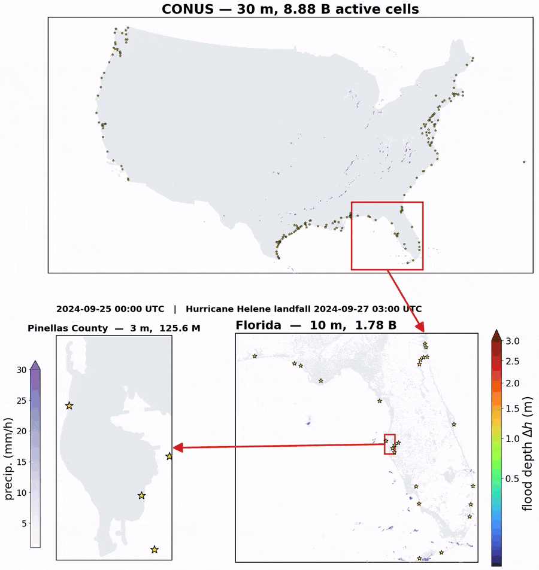
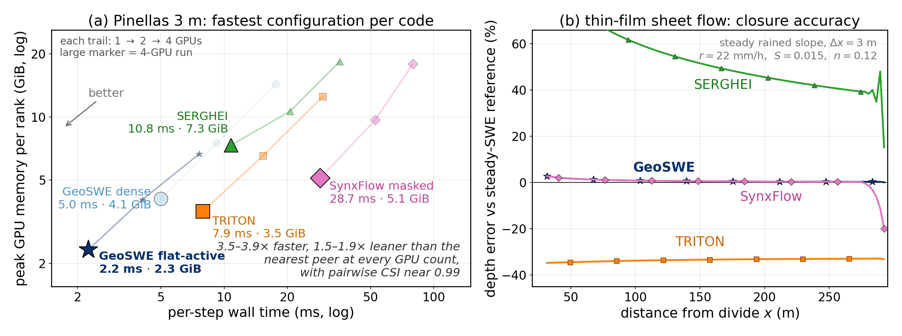
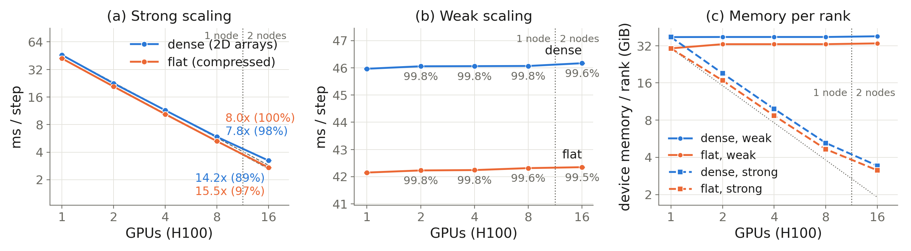

<p align="center">
  
</p>

<h1 align="center">GeoSWE</h1>
<p align="center"><b>Geophysical Shallow-Water Engine</b><br>
A GPU finite-volume solver for the full 2D shallow-water equations,<br>
from a 3 m coastal county to the conterminous United States on one multi-GPU node.</p>

<p align="center">
  <a href="https://github.com/GeoSWE/geoswe/actions/workflows/test.yml"></a>
  <a href="https://github.com/GeoSWE/geoswe/actions/workflows/lint.yml"></a>
  <a href="https://github.com/GeoSWE/geoswe/actions/workflows/docs.yml"></a>
  <a href="LICENSE"></a>
  
</p>

*Above: 72 hours of Hurricane Helene (September 2024) simulated by the same code on three nested domains: MRMS rainfall in purple, flood depth in color, and the NOAA CO-OPS tide gauges that drive the coastal boundary as stars. [Full-resolution video (MP4)](docs/images/helene_cascade.mp4).*

---

GeoSWE solves the nonlinear shallow-water equations with a well-balanced HLLC
finite-volume scheme, Manning friction, wetting and drying, rainfall, and an
observation-driven coastal stage boundary. Its distinguishing feature is a
**compressed active-cell mesh**: the cells that matter (land plus a nearshore
band) are packed into flat arrays before the run, so memory and work scale
with the flooded landscape rather than its bounding rectangle. The same
finite-volume kernel runs on the dense grid and on the compressed mesh, bit for
bit. It runs on NVIDIA GPUs through [CuPy](https://cupy.dev), scales across GPUs
with `mpi4py`, and falls back to NumPy on the CPU for prototyping and CI.

## Highlights

| | |
|---|---|
| **Continental domains on one node** | A 72-hour Hurricane Helene scenario over CONUS at 30 m (8.88 billion active cells, 207-gauge coastal boundary) runs on eight H100 GPUs in 10.8 h; Florida at 10 m (1.78 billion active cells) on four GPUs in 9.5 h. |
| **Fastest and leanest in a four-code benchmark** | On a 214-million-cell county case against TRITON, SynxFlow, and SERGHEI, GeoSWE's active-cell configuration has the lowest wall time and GPU memory at every GPU count: 3.5 to 3.9 times faster and 1.5 to 1.9 times leaner than the nearest peer, with pairwise CSI near 0.99. |
| **Compression without a numerical penalty** | Dense and compressed runs take identical step counts and agree to 0.05 cm RMSE (CSI 1.000) on the same cells. |
| **Near-ideal scaling** | 99.5 % weak-scaling efficiency at 16 H100 GPUs (10.24 billion cells) and 98.8 % at 32 Blackwell MIG slices across two nodes (20.48 billion cells). |
| **Thin-film accuracy** | On a steady rained slope with a high-accuracy reference solution, GeoSWE stays within 1 % of the reference film depth where other codes depart by tens of percent. |

The application runs are computational demonstrations under stated, uncalibrated settings, not validated flood hindcasts.

## How it compares

<p align="center"></p>

*(a) Per-step wall time against peak GPU memory per rank for each code's fastest configuration on the 3 m Pinellas County benchmark (1, 2, and 4 GPUs; large marker = 4 GPUs). (b) Depth error against the steady shallow-water reference on a uniformly rained slope.*

Comparison codes as benchmarked: TRITON (commit `ec35bc4`), SERGHEI (commit `39a10f2`), and SynxFlow 1.0.2; all four in fp32 at CFL 0.5, first-order well-balanced schemes, same H100 node, identical inputs. Builds, decks, and patches are in the paper's reproducibility appendix.

## How it scales

<p align="center"></p>

*Dense and compressed (flat) paths on an everywhere-wet synthetic domain, 640 million cells per GPU, 1 to 16 H100 GPUs across two nodes. Strong scaling reaches 15.5x on 16 GPUs for the compressed path; weak scaling stays above 99 %.*

## What is inside

- **Numerics:** HLLC and local Lax-Friedrichs fluxes; the Xia et al. (2017) surface-reconstruction method and Audusse hydrostatic reconstruction for exact lake-at-rest balance over arbitrary bathymetry; first-order, MUSCL, and fifth-order reconstruction; forward Euler and SSP-RK3.
- **Physics:** point-implicit Manning friction, wetting and drying, gridded rainfall, Green-Ampt infiltration, depth sinks, and an inverse-distance-weighted coastal stage ring driven by NOAA CO-OPS gauge records.
- **Compressed active-cell mesh:** static active set chosen from terrain criteria before the run, `int16` neighbor offsets, a two-cell ghost halo, build-once caching, active-cell-balanced multi-GPU partitions, and checkpoint/restart.
- **Backends:** CuPy on NVIDIA GPUs (fused single-kernel time step), `mpi4py` for multi-GPU runs with CUDA-aware halo exchange, and a NumPy CPU fallback that runs the same scheme in float64.

## Installation

```bash
# CPU only (NumPy backend): enough for the examples, tests, and docs
pip install geoswe

# GPU on CUDA 12 or CUDA 13 drivers, multi-GPU, GeoTIFF I/O, and forcing readers
# (installs one CuPy build with its CUDA headers; do not add a second CuPy build)
pip install "geoswe[gpu,mpi,io,forcings]"

# From source
git clone https://github.com/GeoSWE/geoswe.git && cd geoswe
pip install -e ".[all]"
```

See [docs/installation.md](docs/installation.md) for CUDA and CuPy version notes and the conda environment.

## Quick start

A circular dam break on a flat bed, on the CPU:

```python
import os
os.environ.setdefault("GEOSWE_BACKEND", "numpy")   # CPU backend
import numpy as np
from geoswe import Mesh2D, Config, Solver2D

nx = ny = 200
mesh = Mesh2D(nx=nx, ny=ny, dx=1.0, dy=1.0, ngh=4)
cfg = Config(dtype="float64")   # defaults are the production scheme:
                                # first-order HLLC, SRM well balancing, forward Euler, CFL 0.5

yy, xx = np.meshgrid(np.arange(ny), np.arange(nx))
r = np.hypot(xx - nx / 2, yy - ny / 2)
q0 = np.zeros((3, nx, ny)); q0[0] = np.where(r < 25, 2.0, 1.0)   # h, hu, hv
bed = np.zeros((nx, ny))

s = Solver2D(mesh, cfg, q0, bed)
s.run(t_end=8.0)
print("max depth:", float(s.q_interior[0].max()))
```

[`examples/`](examples/) has runnable scripts for a 1D dam break, a lake-at-rest
check, rain on a slope, convergence order, multi-GPU scaling, and a small
real-terrain coastal flood case with bundled data.

## Reproducing the paper

[`benchmark/`](benchmark/) holds the GeoSWE-side pipeline for the paper's
benchmark cases: the four-code Pinellas County comparison, the steady sheet-flow
plane, and the synthetic scaling sweep. Each case ships the scripts that
prepare the inputs, run the simulations, and produce the reported numbers; see
[`benchmark/README.md`](benchmark/README.md) for data requirements and command
sequences. The Florida and CONUS application pipelines are not part of this
release; they exercise the same solver paths as the Pinellas case.

## Documentation

User guide, configuration reference, the compressed mesh, multi-GPU runs, and
the API reference: **https://geoswe.github.io/geoswe** (or build locally with
`pip install ".[docs]" && sphinx-build -b html docs docs/_build`).

## Citing

If you use GeoSWE, please cite it; see [CITATION.cff](CITATION.cff). A paper
describing the method, the cross-code benchmark, and the county-to-continent
applications is in preparation.

## Acknowledgments

This material is based upon work supported by the National Science Foundation
under Grant No. 2325631 and by a 2025 IDEaS + Cloud Hub award with support from
Microsoft at the Georgia Institute of Technology. Computing resources were
provided in part by the Partnership for an Advanced Computing Environment (PACE)
at Georgia Tech.

## License

BSD 3-Clause; see [LICENSE](LICENSE).
